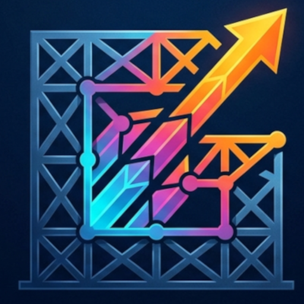
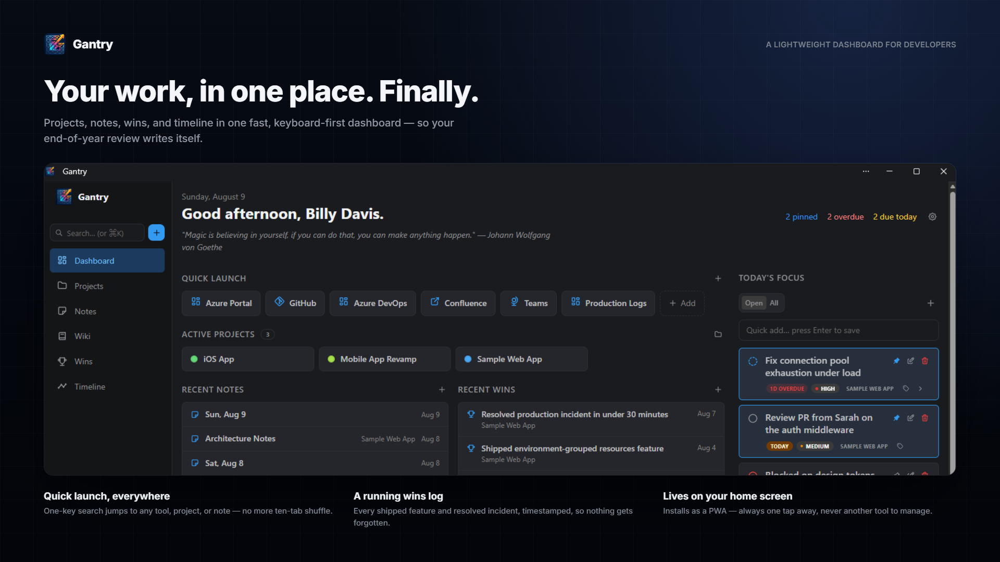

<div align="center">
  

  <h1>Gantry</h1>

  <p>A self-hosted personal work dashboard that answers one question:<br><strong>"What should I be working on right now?"</strong></p>

  <p>
    
    
    
    
    
  </p>
</div>

<p align="center">
  
</p>

---

## What it is

Gantry is a lightweight, keyboard-friendly dashboard for developers who want to stay oriented without switching between ten tools. It's not Notion, Jira, or Confluence — it's a fast, personal system that lives in your browser (or on your home screen as a PWA) and builds a searchable record of your work over time.

The secondary payoff: if you use it consistently, end-of-year self-reviews write themselves from the wins log and timeline instead of from patchy memory.

## Features

| Area | What's included |
|---|---|
| **Dashboard** | Configurable widgets — Today's Focus, Active Projects, Recently Opened, Quick Launch, Recent Notes, Recent Wins |
| **Projects** | Hierarchy via subprojects, color coding, status, tags, environments |
| **Todos** | Status, priority, due dates, pinning, tags, per-project or global |
| **Resources** | Quick-launch links for websites, UNC shares, local paths, repos, dashboards, databases — not just URLs |
| **Notes** | Daily notes with auto-created structure, project notes, scratch pad |
| **Wins log** | Capture accomplishments as they happen; review them at year end |
| **Timeline** | Completed todos + wins aggregated by month |
| **Tags** | Assign to anything; search by tag across all entity types |
| **Global search** | Full-text + tag search across projects, todos, notes, resources, and wins |
| **Command palette** | `Ctrl+K` to jump anywhere or create anything |
| **Themes** | 12 themes × dark/light — Default, Cobalt DOS, Phosphor, Afterglow, Synthwave, Canopy, Graphite, Amber, Sundial, Terracotta, Petal, Rosewood |
| **PWA** | Installable, offline-capable service worker |
| **Mobile** | Responsive layout with collapsible sidebar |

## Stack

| Layer | Technology |
|---|---|
| Backend | ASP.NET Core 10 Minimal APIs, EF Core, FluentValidation |
| Frontend | React, TypeScript, Vite, Mantine UI v7, TanStack Query, React Hook Form + Zod |
| Database | PostgreSQL (JSONB for flexible attributes, full-text search) |
| Deployment | Docker Compose |

Architecture follows Vertical Slice — no MediatR, no mediator abstraction, no `Controllers/Services` split. Each feature is self-contained under `Features/{Entity}/{Action}/`.

## Getting started

**Prerequisites:** Docker Desktop

```sh
git clone https://github.com/billydavis/gantry.git
cd gantry
cp .env.example .env          # review and edit if needed
docker compose up --build
```

Open **http://localhost:5150** in your browser.

The first run applies all database migrations and seeds a set of sample tags automatically.

### Environment variables

`.env.example` documents every variable. The defaults work out of the box for local use. The only thing worth changing before first run:

```env
APP_PORT=5150          # host port the app is served on
POSTGRES_PASSWORD=...  # change this if exposing outside localhost
```

## Upgrading

To pick up a new version, pull the latest code and rebuild:

```sh
git pull
docker compose up --build -d
```

Database migrations run automatically on API startup — no manual migration step needed.

**Do not run `docker compose down -v`** to upgrade. The `-v` flag deletes the Postgres data volume, permanently wiping your projects, todos, notes, wins, and settings. Plain `docker compose down` (no `-v`) stops the containers and is safe — the data volume is preserved and picked back up on the next `up`.

If you ever do need a clean slate on purpose, `docker compose down -v` is the way to do it — just be sure that's what you want first.

## Backups

Settings → Data lets you create a full database backup (via `pg_dump`) before upgrading, and restore back to one if something goes wrong. Backups are stored on their own Docker volume, separate from the Postgres data volume, so they survive even a `docker compose down -v`.

You can also use Download / Upload to move your data to a new machine: download a backup from the old install, copy the file over however you like, then upload and restore it on the new one. This works across app versions — restoring runs pending migrations automatically — but keep `POSTGRES_USER` and `POSTGRES_DB` in `.env` the same on both machines. A mismatch doesn't break the restore, but `pg_restore` will print harmless ownership warnings for the old username it doesn't recognize.

## Development

**Backend** (`src/Gantry.Api`):

The dev connection string isn't checked in — it's stored via [user-secrets](https://learn.microsoft.com/aspnet/core/security/app-secrets) so no credentials ever land in the repo. Set it once per machine:

```sh
dotnet user-secrets set "ConnectionStrings:DefaultConnection" "Host=localhost;Port=5432;Database=gantry;Username=gantry;Password=<your .env POSTGRES_PASSWORD>"
```

```sh
dotnet run                            # API on :5000
dotnet ef migrations add <Name>       # new migration
dotnet ef database update             # apply migrations
```

**Frontend** (`src/web`):

```sh
npm run dev       # Vite dev server on :5173, proxies /api/* → localhost:5000
npm run build     # production build
npx tsc --noEmit  # type-check only
```

See [`ARCHITECTURE.md`](ARCHITECTURE.md) for conventions, [`DATABASE.md`](DATABASE.md) for schema, and [`DECISIONS.md`](DECISIONS.md) for the reasoning behind key choices.

## Roadmap

v1 is complete (released 2026-07-27). All eight phases shipped:

> Phase 0 Scaffolding → Phase 1 Projects → Phase 2 Todos → Phase 3 Resources → Phase 4 Notes → Phase 5 Wins → Phase 6 Tags & Search → Phase 7 Command Palette & Polish

Post-v1 ideas tracked in [`ROADMAP.md`](ROADMAP.md): GitHub integration, calendar sync, AI assistant, authentication, time tracking.

## License

MIT License. See [LICENSE](LICENSE) for details.
